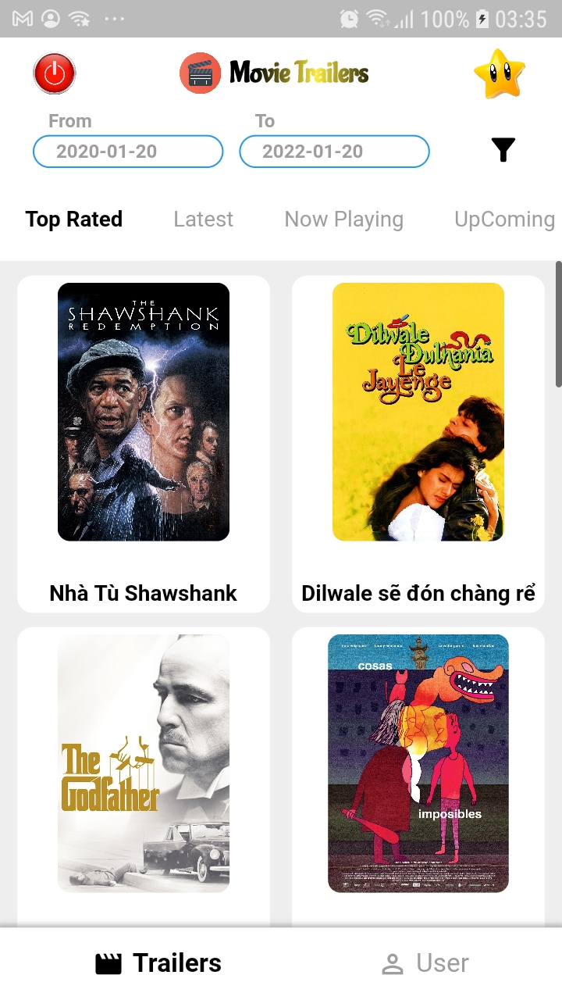
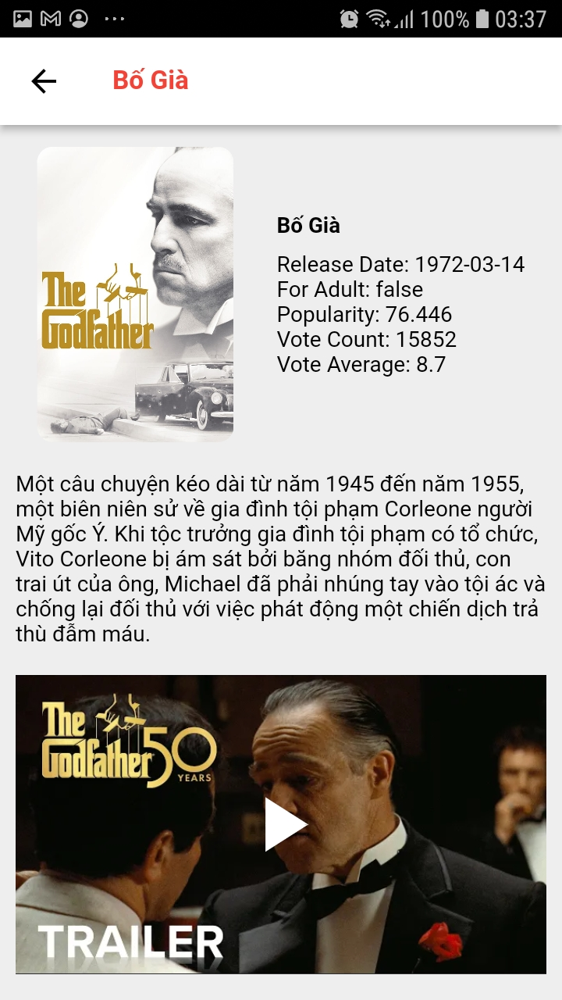

# Movie Trailer

## This is a Movie trailer app:
- Apply flutter clean archetect.
- Auto detect locale of device to fetch data with device locale. Then APIs will return text with device locale.
- Auto detect offline to show warning message. Then when user get connection, it automatically fetch data from API.
- Apply mobx package to store data and communicate with UI.
- Implement bottom navigation.
- Implement body tabbars/ tabviews.
- Implement paging/lazy loading to load more movies when user scroll down to the end of movie list.

 

`flutter packages get`

`flutter run`

