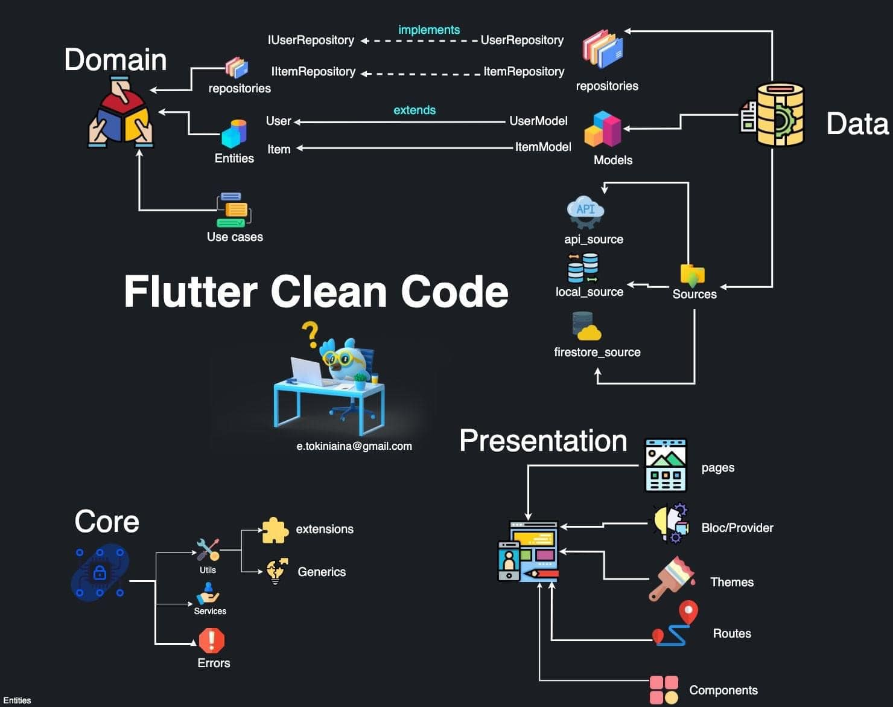

# Movie Trailer

## This is a Movie trailer app:
- Apply flutter clean archetect: 6h.
- Auto detect locale of device to fetch data with device locale. Then APIs will return text with device locale: 4h.
- Auto detect offline to show warning message. Then when user get connection, it automatically fetch data from API: 4h.
- Implement classes/functions to fetch data from TMDB APIs: 8h
- Apply mobx package to store data and communicate with UI: 8h.
- Implement bottom navigation: 6h.
- Implement body tabbars/ tabviews: 3h.
- Implement paging/lazy loading to load more movies when user scroll down to the end of movie list: 6h.

 

## Introduction:
Open project with Visual Studio Code. Open emulator (iphone/android). Then run commands:

`flutter packages get`

`flutter run`

## Libraries and architecture:
- Architecture: Clean architecture:

- Libraries:
    + mobx: State management
    + flare_flutter, flare_dart: animated image
    + shimmer: animated text.
    + http: call api
    + google_fonts: show text using google fonts
    + get_it: Create and use singleton object
    + flutter_screenutil: display a reasonable layouts
    + connectivity_plus: detect on/offline.
    + devicelocale: detect device locale.
    + equatable: compare objects easier.
    + youtube_player_flutter: show and play youtube url.

## My Issues during developing the app:
- Spent time to learn Mobx and apply it to project. I spent time to fix some issues to make mobx work well with UI.
- I spent so much time to keep structure of project clean.
- I planed to do many things but I found that: they are not required to implement. So I'll implement if you need: 
    + User screen(set theme, language, login/logout).
    + Implement tabs: latest, now playing, upcomming.
    + Implement filters: search by title, adult, ....
